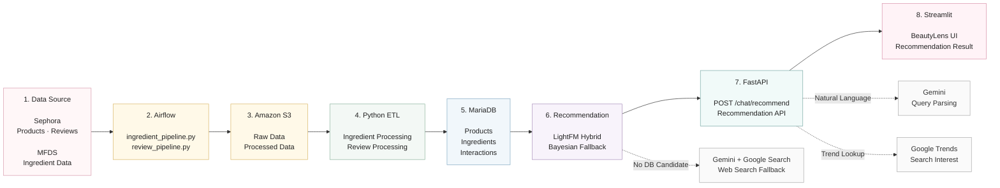

## 3. System Architecture

BeautyLens는 Sephora 상품·리뷰 데이터를 기반으로 전처리 및 추천 데이터를 구성하고,  
LightFM 기반 개인화 추천 결과를 FastAPI와 Streamlit을 통해 제공합니다.



### Recommendation Flow

```text
사용자 질문
    ↓
Gemini 자연어 질의 분석
    ↓
DB 후보 상품 탐색
    ↓
LightFM Hybrid Recommendation
    ↓
추천 결과 반환
```

추천 결과를 생성할 수 없는 경우에는 다음 순서로 fallback을 적용합니다.

| 상황 | 처리 방식 |
|---|---|
| LightFM 추천 가능 | **LightFM Hybrid Recommendation** |
| DB 후보는 있지만 LightFM 추천 불가 | **Bayesian Ranking Fallback** |
| DB에 적합한 후보가 없음 | **Gemini + Google Search** |

> Google Trends는 추천 점수에 직접 반영하지 않고, 추천 결과와 함께 검색 관심도 정보를 제공하는 보조 기능으로 사용합니다.

| Priority | Method | Condition |
| --- | --- | --- |
| 1 | **LightFM Hybrid Recommendation** | DB 후보가 존재하고 LightFM에서 추천 가능한 경우 |
| 2 | **Bayesian Ranking Fallback** | DB 후보는 있지만 LightFM 추천 결과가 없는 경우 |
| 3 | **Gemini + Google Search** | DB에서 조건에 맞는 후보 상품을 찾을 수 없는 경우 |

LightFM은 사용자-상품 interaction과 사용자/상품 side information을 함께 활용합니다.  
신규 사용자의 경우 피부 타입, 피부톤 등의 profile feature를 이용해 cold-start 추천을 수행합니다.
