## 3. System Architecture

BeautyLens는 **데이터 수집 및 전처리 → 데이터베이스 적재 → 추천 → API → UI**까지의 흐름을 하나의 서비스 형태로 구성했습니다.

```mermaid
flowchart LR

    %% =========================
    %% 1. Data Sources
    %% =========================
    subgraph DATA["1. Data Sources"]
        direction TB

        SEPHORA["Sephora Dataset<br/>Products / Reviews"]

        MFDS["MFDS API<br/>성분 사전 / 사용 제한 정보"]

        EXTERNAL["External Data<br/>Google Trends<br/>Google Search"]
    end


    %% =========================
    %% 2. Airflow
    %% =========================
    subgraph AIRFLOW["2. Apache Airflow"]
        direction TB

        ING_DAG["ingredient_pipeline.py<br/>상품·성분 데이터 처리"]

        REVIEW_DAG["review_pipeline.py<br/>리뷰·Interaction 처리"]
    end


    %% =========================
    %% 3. S3
    %% =========================
    subgraph S3["3. Amazon S3"]
        direction TB

        RAW["Raw Data<br/>Product / Review"]

        PROCESSED["Processed Data<br/>Ingredient / Review"]
    end


    %% =========================
    %% 4. ETL
    %% =========================
    subgraph ETL["4. Python / Pandas ETL"]
        direction TB

        ING_ETL["Ingredient Processing<br/>Parsing / Normalization"]

        MFDS_MATCH["MFDS Matching<br/>성분 사전 / 규제 정보"]

        REVIEW_ETL["Review Processing<br/>Interaction 생성"]

        VALIDATE["Validation<br/>DB 적재용 데이터 생성"]
    end


    %% =========================
    %% 5. Database
    %% =========================
    subgraph DB["5. MariaDB"]
        direction TB

        PRODUCTS["products<br/>상품 정보"]

        INGREDIENTS["ingredients<br/>성분 정보"]

        PRODUCT_ING["product_ingredients<br/>상품-성분 관계"]

        INTERACTIONS["interactions<br/>사용자-상품 Interaction"]

        METADATA["dataset_metadata<br/>데이터셋 메타정보"]
    end


    %% =========================
    %% 6. Recommendation
    %% =========================
    subgraph REC["6. Recommendation Engine"]
        direction TB

        FILTER["Candidate Filtering<br/>성분 / 제품 유형 기반 후보 생성"]

        LIGHTFM["LightFM Hybrid Recommendation<br/>Interaction + Side Information"]

        BAYES["Bayesian Ranking Fallback<br/>평점 + 리뷰 수 기반"]

        WEB["Gemini + Google Search<br/>외부 상품 탐색 Fallback"]
    end


    %% =========================
    %% 7. API
    %% =========================
    subgraph API["7. FastAPI"]
        direction TB

        QUERY["Gemini Query Parser<br/>자연어 질의 구조화"]

        ENDPOINT["POST /chat/recommend"]

        TREND["Google Trends<br/>검색 관심도 조회"]

        RESPONSE["Recommendation Response<br/>추천 결과 구성"]
    end


    %% =========================
    %% 8. UI
    %% =========================
    subgraph UI["8. Streamlit · BeautyLens"]
        direction TB

        INPUT["Natural Language Input<br/>피부 고민 / 성분 / 제품 요청"]

        RESULT["Recommendation Result<br/>개인화 상품 추천"]

        BASIS["Recommendation Basis<br/>추천 기준 / 성분 정보"]

        TREND_UI["Trend Information<br/>Google Trends"]

        WEB_UI["External Search Result<br/>웹 상품 탐색 결과"]
    end


    %% =========================
    %% Data Pipeline
    %% =========================

    SEPHORA --> AIRFLOW
    MFDS --> AIRFLOW

    ING_DAG --> RAW
    REVIEW_DAG --> RAW

    RAW --> ING_ETL
    RAW --> REVIEW_ETL

    ING_ETL --> MFDS_MATCH
    MFDS --> MFDS_MATCH

    MFDS_MATCH --> VALIDATE
    REVIEW_ETL --> VALIDATE

    VALIDATE --> PROCESSED
    PROCESSED --> PRODUCTS
    PROCESSED --> INGREDIENTS
    PROCESSED --> PRODUCT_ING
    PROCESSED --> INTERACTIONS
    PROCESSED --> METADATA


    %% =========================
    %% Recommendation Flow
    %% =========================

    INPUT --> ENDPOINT
    ENDPOINT --> QUERY

    QUERY --> FILTER
    PRODUCTS --> FILTER
    INGREDIENTS --> FILTER
    PRODUCT_ING --> FILTER
    INTERACTIONS --> LIGHTFM

    FILTER --> LIGHTFM
    FILTER --> BAYES

    FILTER -. "DB 후보 없음" .-> WEB
    EXTERNAL -.-> WEB

    EXTERNAL -. "Trend Data" .-> TREND

    LIGHTFM --> RESPONSE
    BAYES --> RESPONSE
    WEB --> RESPONSE
    TREND --> RESPONSE

    RESPONSE --> RESULT
    RESPONSE --> BASIS
    RESPONSE --> TREND_UI
    RESPONSE --> WEB_UI


    %% =========================
    %% Style
    %% =========================

    classDef source fill:#FFF7F8,stroke:#E8A0B4,color:#222;
    classDef pipeline fill:#F7F8FF,stroke:#9CA9D8,color:#222;
    classDef storage fill:#FFF9EC,stroke:#E7B96B,color:#222;
    classDef process fill:#F3FAF7,stroke:#8DC5A7,color:#222;
    classDef database fill:#F1F8FC,stroke:#80B4D2,color:#222;
    classDef recommendation fill:#FBF3FF,stroke:#BB92D0,color:#222;
    classDef api fill:#F0FAFA,stroke:#64B8B2,color:#222;
    classDef ui fill:#FFF3F7,stroke:#DC91AF,color:#222;

    class SEPHORA,MFDS,EXTERNAL source;
    class ING_DAG,REVIEW_DAG pipeline;
    class RAW,PROCESSED storage;
    class ING_ETL,MFDS_MATCH,REVIEW_ETL,VALIDATE process;
    class PRODUCTS,INGREDIENTS,PRODUCT_ING,INTERACTIONS,METADATA database;
    class FILTER,LIGHTFM,BAYES,WEB recommendation;
    class QUERY,ENDPOINT,TREND,RESPONSE api;
    class INPUT,RESULT,BASIS,TREND_UI,WEB_UI ui;
```

### Architecture Flow

**Data Pipeline**

`Sephora / MFDS`  
→ `Airflow`  
→ `Amazon S3`  
→ `Python / Pandas ETL`  
→ `MariaDB`

**Recommendation Pipeline**

`사용자 자연어 질문`  
→ `Streamlit`  
→ `FastAPI`  
→ `Gemini Query Parsing`  
→ `Candidate Filtering`  
→ `LightFM / Bayesian / Web Search Fallback`  
→ `추천 결과 반환`

> **Google Trends는 LightFM 추천 점수에 포함하지 않습니다.**  
> 추천 상품과 함께 현재 검색 관심도의 변화를 보여주는 별도 참고 정보로 사용합니다.

### Recommendation Strategy

| Priority | Method | Condition |
| --- | --- | --- |
| 1 | **LightFM Hybrid Recommendation** | DB 후보가 존재하고 LightFM에서 추천 가능한 경우 |
| 2 | **Bayesian Ranking Fallback** | DB 후보는 있지만 LightFM 추천 결과가 없는 경우 |
| 3 | **Gemini + Google Search** | DB에서 조건에 맞는 후보 상품을 찾을 수 없는 경우 |

LightFM은 사용자-상품 interaction과 사용자/상품 side information을 함께 활용합니다.  
신규 사용자의 경우 피부 타입, 피부톤 등의 profile feature를 이용해 cold-start 추천을 수행합니다.
