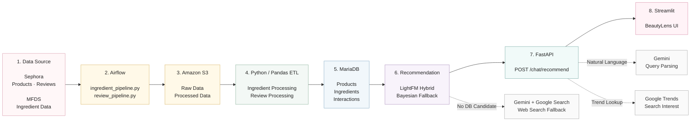

BeautyLens
사용자의 피부 정보와 자연어 질문을 바탕으로 화장품 후보를 탐색하고,  
LightFM 기반 개인화 추천, Bayesian Fallback, Gemini + Google Search, Google Trends를 결합한 화장품 추천 프로토타입입니다.
단순 추천 모델 구현에 그치지 않고,
데이터 수집·전처리 → 성분 정제 → DB 적재 → 추천 → API → UI
까지 이어지는 전체 서비스 흐름을 구현하는 것을 목표로 했습니다.
> 현재는 포트폴리오 및 기능 검증을 위한 프로토타입 단계입니다.  
---
1. Project Overview
BeautyLens는 사용자의 자연어 질문에서 추천 조건을 추출하고,  
조건에 맞는 상품 후보를 데이터베이스에서 찾은 뒤 개인화 추천을 수행합니다.
예를 들어 다음과 같은 질문을 처리할 수 있습니다.
```text
모공이 고민인데 세럼 추천해줘
나이아신아마이드 세럼 추천해줘
건성 피부에 크림 추천해줘
지속력 좋은 쿠션 추천해줘
모공 커버 잘 되는 프라이머 추천해줘
```
추천에 필요한 정보가 부족한 경우에는 추가 질문을 통해 조건을 보완합니다.
```text
사용자: 지속력 좋은 거 추천해줘
BeautyLens: 원하는 제품 종류를 알려주세요.
사용자: 쿠션
```
후속 답변은 기존 질문과 결합해 다시 추천에 사용합니다.
---
2. Key Features
자연어 기반 화장품 추천 질의 처리
피부 타입·피부 고민·성분·제품 유형 기반 후보 필터링
LightFM 기반 Hybrid Recommendation
신규 사용자 프로필을 활용한 cold-start 추천
LightFM 추천이 어려운 경우 Bayesian Ranking Fallback
내부 데이터에 후보가 없는 경우 Gemini + Google Search 기반 외부 상품 탐색
Google Trends 기반 검색 관심도 제공
Sephora 상품·리뷰 데이터 전처리 파이프라인
MFDS 성분 사전 및 사용 제한 정보 결합
FastAPI 추천 API
Streamlit 기반 사용자 인터페이스
---
3. System Architecture
BeautyLens는 데이터 처리 영역과 추천 서비스 영역을 분리해 구성했습니다.

Architecture Flow
```text
Sephora / MFDS
      ↓
Apache Airflow
      ↓
Amazon S3
      ↓
Python / Pandas ETL
      ↓
MariaDB
      ↓
Recommendation Engine
      ↓
FastAPI
      ↓
Streamlit
```
Google Trends는 추천 점수에 직접 합산하지 않고  
추천 결과와 함께 확인할 수 있는 검색 관심도 참고 정보로 제공합니다.
---
4. Recommendation Flow
사용자 요청은 다음 흐름으로 처리됩니다.
```text
사용자 자연어 질문
        ↓
Gemini Query Parsing
        ↓
추천 조건 구조화
        ↓
DB Candidate Filtering
        ↓
LightFM Hybrid Recommendation
        ↓
추천 결과 반환
```
LightFM으로 결과를 만들 수 없는 경우에는 다음 순서로 fallback을 적용합니다.
Priority	Method	Condition
1	LightFM Hybrid Recommendation	DB 후보가 존재하고 LightFM에서 추천 가능한 경우
2	Bayesian Ranking Fallback	DB 후보는 있지만 LightFM 추천 결과가 없는 경우
3	Gemini + Google Search	DB에 조건과 맞는 후보 상품 자체가 없는 경우
외부 검색 결과는 데이터셋 기반 개인화 추천과 구분해 사용자에게 표시합니다.
---
5. Recommendation Logic
5.1 Natural Language Query Parsing
Gemini를 이용해 자연어 질문을 추천 시스템에서 사용할 수 있는 구조로 변환합니다.
주요 추출 항목은 다음과 같습니다.
```text
skin_type
skin_tone
eye_color
hair_color
concerns
ingredient
product_type
recommendation_mode
performance_goal
```
추천 요청은 크게 두 가지 유형으로 구분합니다.
Skincare
피부 타입, 피부 고민, 성분을 중심으로 후보 상품을 탐색합니다.
```text
모공이 고민인데 세럼 추천해줘
건성 피부에 크림 추천해줘
```
Product Performance
커버력, 블러, 지속력, 밀착력, 발색 등 제품 사용 성능과 관련된 요청을 처리합니다.
```text
지속력 좋은 쿠션 추천해줘
모공 커버 잘 되는 프라이머 추천해줘
```
제품 성능 요청에서는 사용자가 성분을 직접 지정하지 않은 경우 성분을 자동 선택하지 않습니다.
---
5.2 Ingredient Selection
사용자가 성분을 직접 입력한 경우 해당 성분을 우선 사용합니다.
```text
나이아신아마이드 세럼 추천해줘
```
성분이 명시되지 않은 스킨케어 요청에서는 피부 타입과 피부 고민을 기준으로 성분 후보를 생성하고,  
실제 데이터베이스에 해당 성분을 포함한 상품이 존재하는지 확인한 뒤 추천에 사용합니다.
---
5.3 LightFM Hybrid Recommendation
추천 모델은 LightFM 기반 Hybrid Recommendation 구조를 사용합니다.
추천 시 다음 정보를 활용합니다.
User Side Information
```text
skin_type
skin_tone
eye_color
hair_color
```
Item Side Information
모델 학습 시 구성한 상품 feature matrix를 활용합니다.
Interaction
리뷰 데이터를 기반으로 생성한 사용자-상품 interaction 정보를 사용합니다.
신규 사용자는 기존 interaction이 없더라도 사용자 프로필 feature를 이용해 추천할 수 있도록 구성했습니다.
> Google Trends 데이터는 LightFM ranking score에 직접 반영하지 않습니다.
---
5.4 Bayesian Ranking Fallback
DB에 후보 상품은 존재하지만 LightFM으로 추천 가능한 상품이 없는 경우  
평점과 리뷰 수를 함께 고려한 Bayesian weighted rating을 사용합니다.
단순 평균 평점만 사용하는 경우 리뷰 수가 적은 상품이 과대평가될 수 있기 때문에  
리뷰 수를 함께 반영해 대체 순위를 계산합니다.
---
5.5 Web Search Fallback
현재 데이터셋에서 조건과 맞는 후보 상품을 찾지 못한 경우  
Gemini + Google Search를 이용해 외부 상품을 탐색합니다.
이 결과는 DB에 저장하지 않고 요청 시점에만 사용하며,  
데이터셋 기반 개인화 추천과 구분해 표시합니다.
---
6. Key Modules
File	Role
`airflow/dags/ingredient_pipeline.py`	Sephora 상품의 성분 데이터를 수집·정제하고 MFDS 정보와 결합하는 Airflow 파이프라인
`airflow/dags/review_pipeline.py`	리뷰 데이터를 전처리하고 추천 모델용 interaction 데이터를 생성
`src/cosmetics/query/user_query_parser.py`	Gemini를 이용해 자연어 질문에서 피부 정보, 제품 유형, 추천 의도 등을 구조화
`src/cosmetics/ingredients/ingredient_repository.py`	후보 상품 조회부터 LightFM·Bayesian·Web Search fallback까지 추천 흐름을 통합 관리
`src/recommendation/sephora_lightfm.py`	사용자-상품 interaction과 side information을 활용한 LightFM Hybrid Recommendation 추론
`src/cosmetics/trends/google_trends_collector.py`	추천 결과와 함께 보여줄 Google Trends 검색 관심도를 계산
`src/cosmetics/trends/product_trend_collector.py`	DB 후보가 없을 때 Gemini + Google Search로 외부 상품을 탐색
`src/api/main.py`	자연어 추천 요청을 처리하고 결과를 반환하는 FastAPI 백엔드
`streamlit/streamlit_app.py`	자연어 입력, 추천 결과, 추천 기준 및 트렌드 정보를 제공하는 BeautyLens UI
---
7. Data Pipeline
Ingredient Pipeline
```text
Sephora Product Data
        ↓
Ingredient Parsing
        ↓
Ingredient Normalization
        ↓
MFDS Ingredient Matching
        ↓
MFDS Regulation Filtering
        ↓
Product-Ingredient Mapping
        ↓
MariaDB
```
상품의 원재료 문자열을 파싱하고 정규화된 `ingredient_key`를 생성한 뒤,  
MFDS 성분 데이터와 매칭해 성분명 및 사용 제한 정보를 결합합니다.
---
Review Pipeline
```text
Sephora Review Data
        ↓
Review Cleaning
        ↓
Interaction Generation
        ↓
Validation
        ↓
MariaDB
```
리뷰 데이터는 추천 모델에서 사용할 사용자-상품 interaction 데이터로 가공합니다.
상품 카드에 표시되는 날짜는 가격 기준일이 아니라  
**해당 상품의 최신 리뷰 `submission_time`**을 기준으로 합니다.
---
8. Project Structure
```text
recommendation_system/
├─ airflow/
│  └─ dags/
│     ├─ ingredient_pipeline.py
│     └─ review_pipeline.py
│
├─ src/
│  ├─ api/
│  │  └─ main.py
│  │
│  ├─ cosmetics/
│  │  ├─ ingredients/
│  │  │  ├─ ingredient_candidate_selector.py
│  │  │  ├─ ingredient_dictionary_builder.py
│  │  │  ├─ ingredient_extractor.py
│  │  │  ├─ ingredient_regulation_filter.py
│  │  │  └─ ingredient_repository.py
│  │  │
│  │  ├─ query/
│  │  │  └─ user_query_parser.py
│  │  │
│  │  └─ trends/
│  │     ├─ google_trends_collector.py
│  │     └─ product_trend_collector.py
│  │
│  ├─ database/
│  │  ├─ check_sephora_product_urls.py
│  │  ├─ load_ingredients.py
│  │  ├─ load_product_ingredients.py
│  │  └─ load_products.py
│  │
│  └─ recommendation/
│     └─ sephora_lightfm.py
│
├─ streamlit/
│  └─ streamlit_app.py
│
├─ requirements.txt
├─ .gitignore
└─ README.md
```
---
9. Database
주요 데이터는 MariaDB에서 관리합니다.
Data	Description
`products`	상품명, 브랜드, 가격, 평점, 리뷰 수, 최신 리뷰일 등 상품 정보
`ingredients`	정규화된 성분명, MFDS 정보, 규제 정보 및 추천 가능 여부
`product_ingredients`	상품과 성분 간 연결 정보
`interactions`	추천 모델에서 활용하는 사용자-상품 interaction
`dataset_metadata`	데이터셋 최신 리뷰일 등 메타데이터
상품 URL은 Sephora sitemap의 상품 ID와 `product_id`를 매칭해 저장합니다.
---
10. Google Trends
Google Trends는 추천 결과의 순위를 결정하는 모델 feature가 아니라  
사용자가 현재 검색 관심도를 참고할 수 있도록 제공하는 보조 정보입니다.
기본 조회 범위:
```text
최근 12개월
```
변화율 비교:
```text
최근 4주 평균
vs
직전 4주 평균
```
Google Trends의 관심도 지수는 실제 검색량이 아니라  
조회 기간과 지역 내에서 0~100으로 정규화된 상대적 관심도입니다.
---
11. Tech Stack
Category	Technology
Language	Python
Data Processing	Pandas, NumPy, SciPy
Recommendation	LightFM, Joblib
Backend	FastAPI, Uvicorn
Frontend	Streamlit
Database	MariaDB, PyMySQL
Pipeline	Apache Airflow
Storage	Amazon S3, Boto3
LLM / Search	Gemini API, Google Search Grounding
Trend Data	Google Trends
External Data	Sephora Dataset, MFDS Ingredient API
---
12. Local Run
1. Clone Repository
```bash
git clone https://github.com/KMINNNNJ/recommendation_system.git
cd recommendation_system
```
2. Install Packages
```bash
pip install -r requirements.txt
```
3. Environment Variables
프로젝트 루트에 `.env` 파일을 생성합니다.
```env
AWS_PROFILE=
AWS_REGION=
S3_BUCKET=

DB_HOST=localhost
DB_PORT=3306
DB_NAME=
DB_USER=
DB_PASSWORD=

GEMINI_API_KEY=
GEMINI_MODEL=

PRODUCT_TREND_GEO=KR
PRODUCT_TREND_TOP_N=5
```
실제 API Key, DB 비밀번호 및 credential 파일은 GitHub에 포함하지 않습니다.
4. Model File
LightFM 모델 파일은 다음 경로를 사용합니다.
```text
models/sephora_hybrid_lightfm.joblib
```
모델 artifact는 repository에 포함하지 않습니다.
5. Run FastAPI
```bash
uvicorn src.api.main:app --reload --reload-dir src --host 127.0.0.1 --port 8000
```
6. Run Streamlit
```bash
streamlit run streamlit/streamlit_app.py
```
로컬 실행 시 Streamlit은 FastAPI 추천 엔드포인트를 호출합니다.
```text
http://127.0.0.1:8000/chat/recommend
```
---
13. Security
다음 파일 및 데이터는 GitHub repository에 포함하지 않습니다.
```text
.env
airflow/.env
API credential files
raw / processed datasets
trained model artifacts
Airflow runtime logs
local database files
download files
```
민감 정보는 환경변수로 관리하고,  
대용량 데이터와 모델 artifact는 repository와 분리해 관리합니다.
---
14. Current Limitations
Product Performance Data
현재 데이터셋에는 다음과 같은 제품 사용 성능에 대한 직접 측정값이 없습니다.
```text
커버력
블러
지속력
밀착력
발색
```
따라서 제품 성능 관련 질문은 요청 의도와 제품 유형을 해석해 후보를 탐색할 수 있지만,  
실제 제품 성능이 우수하다고 검증한 순위는 아닙니다.
Google Trends
Google Trends는 추천 결과를 설명하기 위한 참고 정보이며  
LightFM ranking score에는 직접 반영하지 않습니다.
Web Search Fallback
Gemini + Google Search 결과는 데이터셋 기반 개인화 추천이 아니라  
내부 데이터에서 후보를 찾지 못했을 때 제공하는 보조 결과입니다.
Model Evaluation
현재는 추천 파이프라인과 신규 사용자 추천 흐름 구현에 초점을 두고 있습니다.
향후 다음과 같은 지표를 이용해 추천 모델을 정량적으로 평가할 예정입니다.
```text
Precision@K
Recall@K
AUC
```
또한 CF-only 모델과 Hybrid 모델을 비교해 side information의 효과를 검증할 계획입니다.
---
15. Future Work
LightFM 추천 모델 정량 평가
CF-only 모델과 Hybrid 모델 성능 비교
신규 사용자 cold-start 성능 분석
상품 content feature 확장
제품 성능 관련 데이터 확보
추천 설명 기능 개선
Google Trends 활용 방식 고도화
배포 환경의 DB 및 모델 관리 개선
사용자 피드백 기반 추천 품질 개선
---
16. Feedback
현재 BeautyLens는 기능 검증을 위한 프로토타입입니다.
다음 항목을 중심으로 피드백을 받고 싶습니다.
자연어 기반 추천 흐름이 이해하기 쉬운지
추가 질문 방식이 자연스러운지
추천 기준이 충분히 설명되고 있는지
LightFM → Bayesian → Web Search fallback 구조가 적절한지
Google Trends 정보를 함께 제공하는 방식이 유용한지
데이터 파이프라인 및 서비스 구조에서 개선할 부분이 있는지
피드백을 반영해 추천 품질과 서비스 구조를 지속적으로 개선할 예정입니다.
---
Repository Note
본 repository는 포트폴리오 및 프로토타입 공유 목적으로 공개합니다.
원본 데이터셋, 학습된 모델 파일, API Key, DB credential 등은 repository에 포함하지 않습니다.
